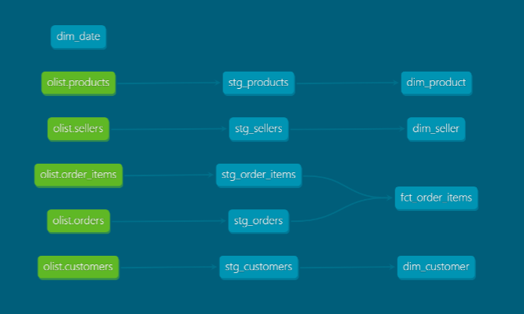
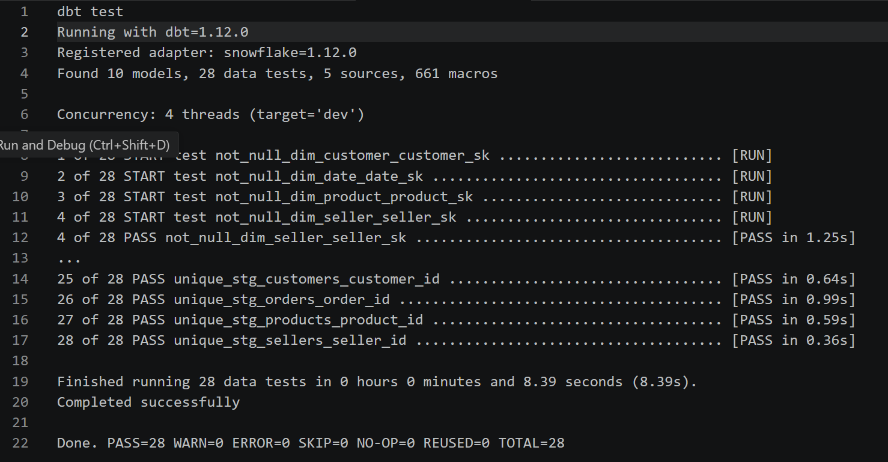

 # Olist Star Schema &mdash; dbt + Snowflake
#### A dbt + Snowflake star schema modeling the Olist Brazilian e-commerce dataset, with tested referential integrity.



*Figure 1: dbt Lineage Graph. A modular transformation pipeline of raw Olist source tables to staging views to star schema marts surrounded by dimensions.*

> **Note:** Date dimension **`dim_date`** is generated from the `date_spine` macro rather than a source. This is why there is no upstream source.

## Tech Stack 

dbt Core compiles and orchestrates SQL transformations; Snowflake stores the data and runs the compute; `dbt_utils` supplies the surrogate-key and test macros.

## Architecture
```
raw sources → staging → dimensions + fact → tests
```

dbt Core compiles SQL models and pushes them to Snowflake, which stores the data and executes the compute — dbt orchestrates, Snowflake runs. Build order is derived automatically from `ref()` and `source()` dependencies rather than declared by hand, and the same dependency graph renders as the lineage in Figure 1. Every model is tested before downstream models build on it, so integrity is enforced within the pipeline rather than discovered after the data has moved.
 
 
## Modeling and Grain

Star schema — one central fact table (the events, at a defined grain) surrounded by dimension tables (the descriptive context). 

* Fact: `fct_order_items` — grain of one row per item per order.  Measures: price and freight_value. Foreign keys (FK) out to each dimension. Each row represents one order line item, so row count = item count.

* Dimensions: `dim_customer`, `dim_product`, `dim_seller`, `dim_date`. 

## Modeling Decisions

* Keyed on `customer_id` **not** `customer_unique_id`, because deduplicating to the person would drop order-level rows while adding no behavioral dimensions the star could actually use.

* `dayname()` and `monthname()` both return abbreviations. Chose not to add a `case` statement to the query language which would complicate the build without improving legibility.

 **Two databases are in use. Why?**
 
 The two databases and what they contain:
 * OLIST_RAW → schema RAW → loaded source CSVs
 * OLIST → schema DBT_DEV → everything dbt builds (staging, dimensions, fact)

Raw data lands in a dedicated OLIST_RAW database; dbt reads from there and builds the modeled star into OLIST.DBT_DEV, keeping ingestion and transformation cleanly separated.

## Testing

**28 tests, 28 passed.**

Four relationships tests prove every one of 112,650 fact rows resolves to a real dimension row.

* Tests: unique + not_null on every key, relationships tests for FK integrity between fact and dimensions.

* `packages.yml` contains the data transformation and testing macros found in `dbt-labs/dbt_utils`. 
 
---

 
 ---
 
  ### The File Tree
```
  olist_star/
├── dbt_project.yml          ← project metadata
├── packages.yml             ← dbt project deps
├── models/                  
│   ├── staging/             
│   │   ├── _sources.yaml
│   │   ├── _stg_schema.yaml
│   │   └── stg_*.sql        (orders, order_items, customers, products, sellers)
│   └── marts/               
│       ├── _marts_schema.yaml
│       ├── dim_*.sql        (customer, product, seller, date)
│       └── fct_order_items.sql 
├── docs/ 
│    ├ img
├── SETUP.md
├── README.md
├── .gitignore
```
---
### SETUP 
 Please see the SETUP.md file for reproduction.
